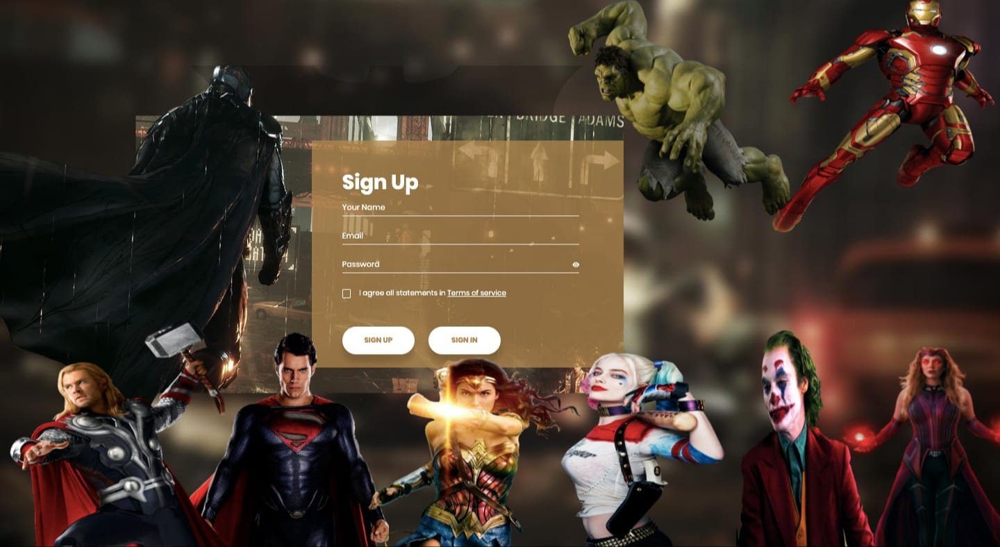

 

# Marvel-DC Sign In /Sign Up Form

I made it by using HTML,CSS, SCSS, JQuery and JavaScript. 

### **If you want to use it for your websites do not forget to change onClick="window.location.href='http://127.0.0.1:5500/signin.html'" part in index.html and signin.html .**

 

## Author
 <em>&copy; Buse Nur Çetin </em>

